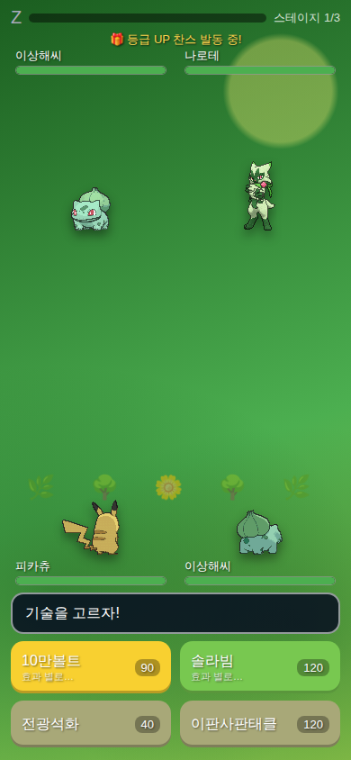
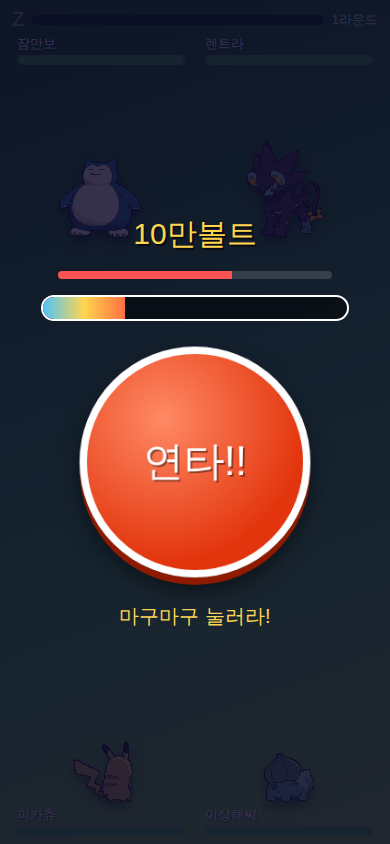
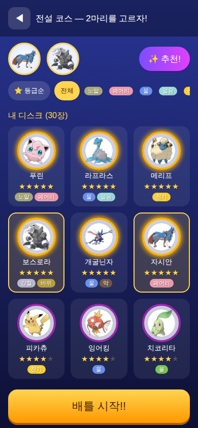
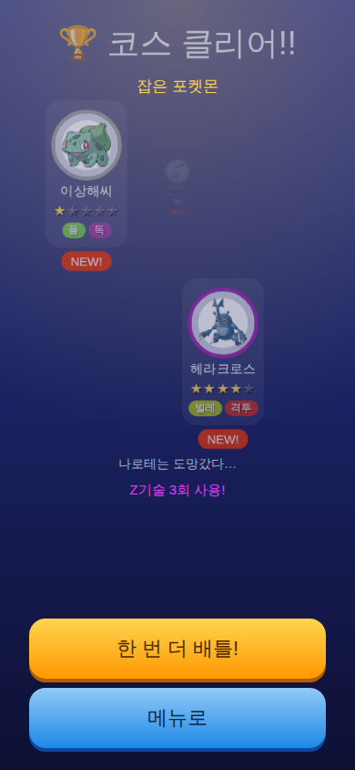

# 포켓몬 가오레 (모바일 웹) 🎮

아케이드 게임 **포켓몬 가오레**를 휴대폰 브라우저에서 즐길 수 있게 만든 비상업적 팬 게임이에요.

## ▶️ 바로 플레이

GitHub Pages로 배포되며, 주소는 다음 형식이에요:

```
https://<GitHub-사용자명>.github.io/pokemon_gaole/
```

휴대폰 브라우저에서 열고 **"홈 화면에 추가"** 하면 앱처럼 전체 화면으로 즐길 수 있어요 (PWA·오프라인 지원).

| 배틀 | 연타 러시 | 팀 선택 | 코스 클리어 |
|---|---|---|---|
|  |  |  |  |

## 게임 방법

1. **코스 선택** — 풀숲 🌿 / 바다 🌊 / 동굴 ⛰️ 코스 중 하나를 고르세요.
   전설 코스 ⚡는 포켓몬 10마리를 잡으면 열려요!
2. **포켓몬 2마리 선택** — 처음에는 렌탈 포켓몬으로 시작해요.
   디스크가 많아지면 ✨추천 버튼이 코스에 잘 맞는 2마리를 골라줘요.
3. **코스는 3연전!** — 스테이지 1 → 2 → 👑보스를 모두 이기면 코스 클리어!
   스테이지 사이에 HP가 회복되고 쓰러진 동료도 살아나요.
4. **배틀!** — 기술을 고르고 **버튼을 마구마구 연타**하면 공격이 강해져요.
   - 연타가 끝나면 **공격 배율 룰렛**(×1~×3)을 탭으로 멈춰요
   - 적이 공격할 땐 **방어 룰렛**으로 막아요 (완전 방어 시 피해 0)
   - 💥"효과 굉장!" 표시가 붙은 기술이 잘 통하는 기술이에요
   - 적을 탭하면 직접 조준할 수 있어요 🎯
   - Z게이지가 가득 차면 강력한 **Z기술**!
   - 5성 디스크는 **메가진화**도 가능! (코스당 1회, 23종)
   - 위기에 몰리면 배틀 도중에 진화할 수도…!
5. **겟 찬스!** — 야생 포켓몬을 쓰러뜨리면 볼 룰렛이 나와요.
   포켓몬을 많이 잡을수록 좋은 볼 칸이 넓어져요 (20/50/100마리).
6. **디스크 수집** — 잡은 포켓몬은 1~5성 디스크가 돼요. (1~9세대 208마리!)
   같은 포켓몬을 더 높은 등급으로 잡으면 **그레이드 업!**
7. **보너스** — 매일 첫 배틀은 등급 UP 찬스! 져도 참가 스탬프 🎫를 받고
   5개 모으면 등급 UP 찬스와 바꿔줘요.

가끔 **거대한 그림자**(전설의 포켓몬)가 배틀에 난입하니 조심하세요…!
아주 드물게 **✨색이 다른 포켓몬(샤이니)**도 나타나요 — 잡으면 디스크와 도감에 ✨로 남아요!

🔰 메뉴의 **타입 상성표**에서 어떤 타입이 무엇에 강하고 약한지 공부할 수 있어요.
디스크를 누르면 그 포켓몬의 약점·잘 버티는 타입도 함께 보여줘요.
🔊 소리 버튼으로 끄기 → 작게 → 크게 3단계로 볼륨을 조절할 수 있어요.

💾 메뉴의 백업 버튼으로 저장 데이터를 코드로 내보내고 복원할 수 있어요.
(진행 상황은 휴대폰에 자동 저장돼요. 휴대폰이나 주소를 바꿀 때 백업 코드를 쓰세요!)

## 개발

```bash
npm install
npm run dev          # 개발 서버
npm test             # 배틀 엔진 단위 테스트 (vitest)
npm run build        # 빌드 (dist/) + 서비스 워커 버전 스탬프
npm run build:data   # PokeAPI 미러에서 포켓몬 데이터·이미지 재생성
npm run build:thumbs # 도감용 WebP 썸네일 재생성 (pip install pillow 필요)
npm run e2e          # 전체 게임 루프 E2E (사전: npx playwright install chromium,
                     #  npm run preview 실행 후 BASE_URL 지정)
```

### 구조

```
scripts/roster.mjs       # 로스터 정의 (208마리: id·레어도·코스·진화·메가)
scripts/build-data.mjs   # 데이터 파이프라인 → src/data/*.json + public/sprites/
src/engine/              # 순수 배틀 로직 (battle/damage/catch/events) — React 무관, 테스트 대상
src/store/               # zustand 전역 상태 + localStorage 저장(v2, 마이그레이션·백업)
src/screens/             # 화면 (타이틀/메뉴/코스/팀/배틀/결과/컬렉션/도감)
src/components/          # 러시 버튼, 볼 룰렛, 배율 룰렛, 겟찬스, 디스크 카드, 튜토리얼 등
src/audio/               # Web Audio 합성 효과음 + 8비트풍 BGM (음원 파일 없음)
public/sprites/          # 셀프호스팅 이미지 (아트워크·썸네일·배틀 GIF)
```

- 포켓몬 데이터(한국어 이름·기술·타입 상성)는 [PokeAPI](https://github.com/PokeAPI/api-data)
  GitHub 미러에서 빌드 시 생성해 커밋합니다. **런타임에는 외부 API를 호출하지 않아요.**
- 이미지는 [PokeAPI/sprites](https://github.com/PokeAPI/sprites)에서 받아 함께 배포합니다.
- 밸런스 상수는 `src/engine/damage.ts`의 `TUNING` 객체 한곳에 모여 있어요
  (난이도 조정은 여기서). 코스 배율은 `src/data/courses.ts`.

### 배포

`main` 브랜치에 푸시하면 GitHub Actions가 테스트 → 빌드 → `gh-pages` 브랜치로 자동 배포합니다.
처음 한 번만 저장소 **Settings → Pages → Source**를 `gh-pages` 브랜치로 지정하세요.
(무료 플랜에서는 저장소가 **공개**여야 Pages가 게시됩니다.)

### 포크해서 내 계정에 배포하기

이 저장소를 본인 GitHub 계정으로 포크하면 코드 수정 없이 그대로 배포돼요:

1. 포크한 저장소의 **Actions 탭**에서 워크플로를 활성화(`I understand my workflows, enable them`)
2. `main`에 커밋을 푸시하거나 Actions에서 수동 실행 → `gh-pages` 브랜치가 생성됨
3. **Settings → Pages → Source**를 `gh-pages` 브랜치로 지정
4. `https://<내-사용자명>.github.io/pokemon_gaole/` 에서 플레이

> 저장소 **이름을 `pokemon_gaole`로 유지**하면 경로 설정을 안 건드려도 돼요.
> 이름을 바꾸려면 `vite.config.ts`의 `base`만 새 이름으로 바꾸면 됩니다.

변경 기록은 [CHANGELOG.md](CHANGELOG.md)에서 확인할 수 있어요.

---

이 프로젝트는 비상업적 팬 게임입니다. 포켓몬 관련 명칭·이미지의 권리는
Nintendo / Creatures / GAME FREAK / The Pokémon Company / Takara Tomy에 있습니다.
